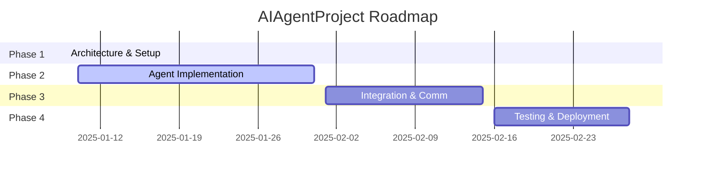

# AIAgentProject - Project Roadmap

## 🎯 Project Vision
Create a sophisticated multi-agent trading system with 8 specialized agents coordinated by a main orchestrator, operating across 6 architectural layers for financial analysis, strategy development, and automated trading execution.

## 📋 Project Phases Overview

## 🏗️ Detailed Phase Breakdown

### Phase 1: Architecture & Basic Configuration ✅
**Duration**: Jan 9, 2025 (1 day)  
**Status**: COMPLETED  
**Progress**: 100%

#### Objectives
- Establish project foundation and architecture
- Create documentation framework
- Define agent responsibilities and interfaces

#### Deliverables ✅
- [x] System architecture design (Excalidraw + PNG)
- [x] Project folder structure (Project/ hierarchy)
- [x] Agent responsibility matrix
- [x] Access control and permissions framework
- [x] Initial README and documentation
- [x] Git repository setup with initial commits

#### Key Achievements
- Created comprehensive 6-layer architecture
- Defined 8 specialized agents with clear responsibilities
- Established security and access control framework
- Set up project management structure

---

### Phase 2: Detailed Agent Implementation 🔄
**Duration**: Jan 10-31, 2025 (22 days)  
**Status**: IN PROGRESS (40% complete)  
**Priority**: HIGH

#### Objectives
- Implement detailed configuration for all 8 agents
- Create comprehensive documentation for each agent
- Establish data interfaces and API specifications
- Define operational workflows

#### Deliverables Progress
- [ ] **Strategy Agent** (95% ✅)
  - [x] Configuration system (YAML)
  - [x] Permissions framework
  - [x] Data interface specifications
  - [x] API documentation
  - [x] Workflow documentation
  - [ ] Unit test templates

- [ ] **Data Agent** (70% 🔄)
  - [x] Configuration system
  - [x] Permissions framework
  - [x] Data interface specifications
  - [ ] API documentation
  - [ ] Workflow documentation

- [ ] **Trade Agent** (30% 🔄)
  - [x] Basic configuration
  - [ ] Permissions framework
  - [ ] Data interface specifications
  - [ ] API documentation
  - [ ] Workflow documentation

- [ ] **Model Agent** (5% ⏳)
  - [ ] Configuration system
  - [ ] Permissions framework
  - [ ] Data interface specifications
  - [ ] API documentation
  - [ ] Workflow documentation

- [ ] **Backtest Agent** (5% ⏳)
  - [ ] Configuration system
  - [ ] Permissions framework
  - [ ] Data interface specifications
  - [ ] API documentation
  - [ ] Workflow documentation

- [ ] **Evaluation Agent** (5% ⏳)
  - [ ] Configuration system
  - [ ] Permissions framework
  - [ ] Data interface specifications
  - [ ] API documentation
  - [ ] Workflow documentation

- [ ] **API Agent** (5% ⏳)
  - [ ] Configuration system
  - [ ] Permissions framework
  - [ ] Data interface specifications
  - [ ] API documentation
  - [ ] Workflow documentation

- [ ] **GetStockData Agent** (5% ⏳)
  - [ ] Configuration system
  - [ ] Permissions framework
  - [ ] Data interface specifications
  - [ ] API documentation
  - [ ] Workflow documentation

#### Critical Milestones
- **Jan 12**: Complete Trade Agent implementation
- **Jan 15**: Complete Model and Backtest Agents
- **Jan 18**: Complete Evaluation, API, and GetStockData Agents
- **Jan 22**: Phase 2 completion review

---

### Phase 3: Integration & Communication ⏳
**Duration**: Jan 24 - Feb 7, 2024 (15 days)  
**Status**: PLANNED  
**Priority**: HIGH

#### Objectives
- Implement inter-agent communication protocols
- Create orchestrator task management system
- Establish data flow pipelines
- Implement monitoring and logging

#### Planned Deliverables
- [ ] **Communication Framework**
  - [ ] Message bus architecture
  - [ ] Protocol specifications (JSON, Markdown)
  - [ ] Error handling and retry logic
  - [ ] Queue management system

- [ ] **Orchestrator Enhancement**
  - [ ] Task distribution engine
  - [ ] Workflow management
  - [ ] Resource scheduling
  - [ ] Health monitoring dashboard

- [ ] **Data Pipeline Integration**
  - [ ] Real-time data flow setup
  - [ ] Batch processing workflows
  - [ ] Data quality monitoring
  - [ ] Backup and recovery systems

- [ ] **System Integration**
  - [ ] End-to-end workflow testing
  - [ ] Performance benchmarking
  - [ ] Security audit
  - [ ] Documentation updates

#### Key Milestones
- **Jan 28**: Communication protocols implemented
- **Feb 2**: Orchestrator task management complete
- **Feb 5**: Full system integration testing
- **Feb 7**: Phase 3 completion and Phase 4 readiness

---

### Phase 4: Testing & Deployment ⏳
**Duration**: Feb 8-21, 2024 (14 days)  
**Status**: PLANNED  
**Priority**: MEDIUM

#### Objectives
- Comprehensive system testing
- Performance optimization
- Production deployment preparation
- User documentation and training

#### Planned Deliverables
- [ ] **Testing Framework**
  - [ ] Unit tests for all agents
  - [ ] Integration test suites
  - [ ] Performance test scenarios
  - [ ] Security penetration testing

- [ ] **Optimization & Tuning**
  - [ ] Performance optimization
  - [ ] Resource usage optimization
  - [ ] Latency improvements
  - [ ] Scalability testing

- [ ] **Deployment Preparation**
  - [ ] Production environment setup
  - [ ] CI/CD pipeline creation
  - [ ] Monitoring and alerting
  - [ ] Backup and disaster recovery

- [ ] **Documentation & Training**
  - [ ] User manuals
  - [ ] Administrator guides
  - [ ] API documentation
  - [ ] Training materials

#### Key Milestones
- **Feb 12**: Testing framework complete
- **Feb 16**: Performance optimization complete
- **Feb 19**: Production deployment ready
- **Feb 21**: Project completion and handover

## 🎯 Success Criteria

### Phase 2 Success Metrics
- [ ] All 8 agents fully configured and documented
- [ ] 100% API documentation coverage
- [ ] All data interfaces specified
- [ ] Workflow documentation complete

### Phase 3 Success Metrics
- [ ] Inter-agent communication working end-to-end
- [ ] Orchestrator managing tasks across all agents
- [ ] Real-time data flow operational
- [ ] System monitoring and alerting functional

### Phase 4 Success Metrics
- [ ] All tests passing (unit, integration, performance)
- [ ] System ready for production deployment
- [ ] Documentation complete and reviewed
- [ ] Team trained on system operation

## 🚨 Risk Management

### High-Risk Areas
1. **Agent Complexity Creep**
   - **Risk**: Individual agents becoming overly complex
   - **Mitigation**: Regular architecture reviews, modular design
   - **Timeline Impact**: Medium

2. **Integration Challenges**
   - **Risk**: Agents not communicating properly
   - **Mitigation**: Early prototyping, incremental integration
   - **Timeline Impact**: High

3. **Performance Requirements**
   - **Risk**: System not meeting latency requirements
   - **Mitigation**: Early performance testing, optimization sprints
   - **Timeline Impact**: Medium

### Contingency Plans
- **Schedule Buffer**: 20% time buffer built into each phase
- **Scope Reduction**: Feature prioritization matrix prepared
- **Resource Scaling**: Additional development resources identified

## 📊 Resource Requirements

### Development Resources
- **Architecture/Design**: 25% of effort
- **Implementation**: 50% of effort  
- **Testing**: 15% of effort
- **Documentation**: 10% of effort

### Key Dependencies
- External API access (AlphaVantage, Yahoo Finance)
- Cloud infrastructure for deployment
- Testing environments
- Performance monitoring tools

## 🔄 Review & Update Schedule
- **Weekly Reviews**: Every Monday at 10:00 AM
- **Phase Gate Reviews**: At end of each phase
- **Roadmap Updates**: Monthly or as needed
- **Stakeholder Updates**: Bi-weekly

---
**Roadmap Version**: 1.0  
**Last Updated**: 2024-01-09  
**Next Review**: 2024-01-16