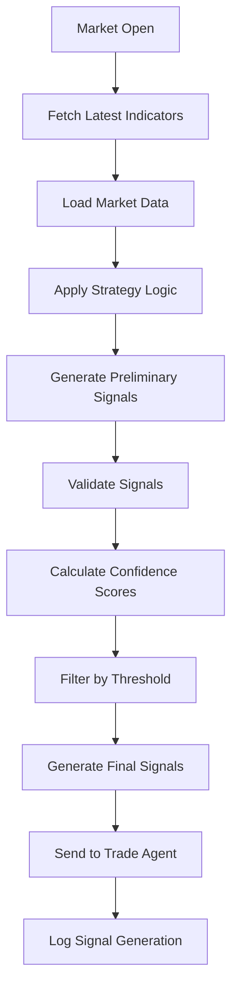
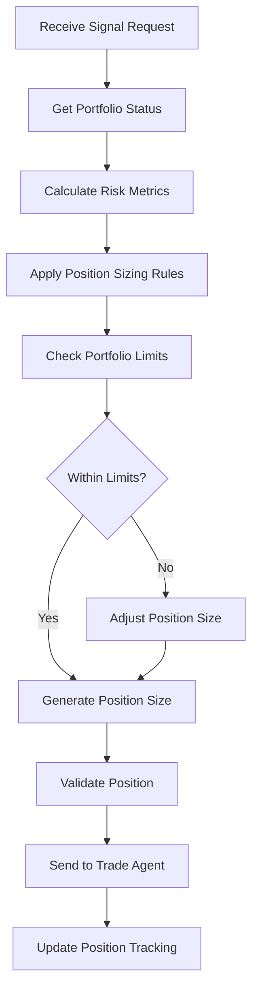
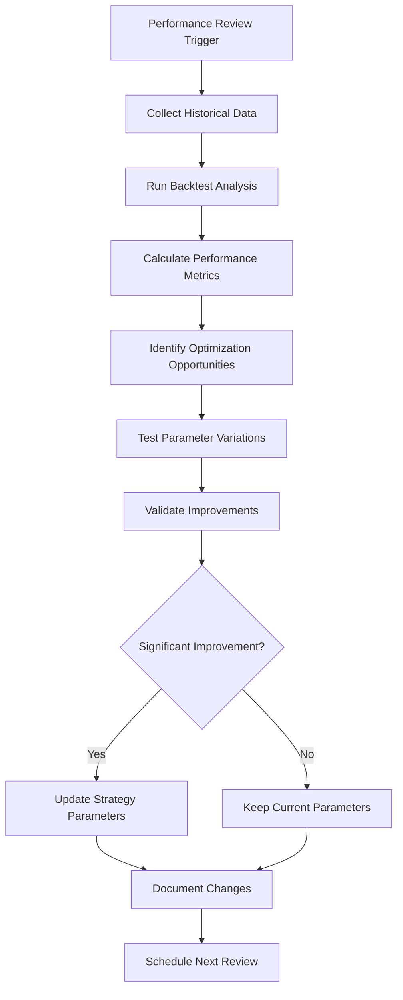
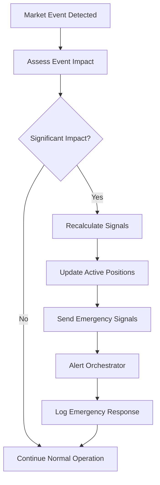

# Strategy Agent Workflows

## Overview
This document outlines the key workflows and processes managed by the Strategy Agent within the AIAgentProject trading system.

## Core Workflows

### 1. Daily Signal Generation Workflow



**Steps:**
1. **Market Open Trigger**: Activated at market opening or on-demand
2. **Data Collection**: Fetch latest technical indicators from Indicator Layer
3. **Strategy Execution**: Apply configured strategy algorithms
4. **Signal Validation**: Ensure signals meet quality criteria
5. **Output Generation**: Create formatted signals for Trade Agent
6. **Logging**: Record all signal generation activities

### 2. Position Sizing Workflow



**Key Components:**
- Risk assessment based on volatility
- Portfolio exposure limits
- Kelly criterion optimization
- Dynamic position adjustments

### 3. Strategy Optimization Workflow



### 4. Real-time Market Response Workflow



## Workflow Schedules

### Regular Schedules
| Workflow | Frequency | Time (EST) | Duration |
|----------|-----------|------------|----------|
| Pre-market Analysis | Daily | 08:00 | 30 min |
| Market Open Signals | Daily | 09:30 | 15 min |
| Midday Review | Daily | 12:00 | 10 min |
| End of Day Analysis | Daily | 16:30 | 45 min |
| Weekly Optimization | Weekly | Sun 18:00 | 2 hours |
| Monthly Performance Review | Monthly | 1st Sun 10:00 | 4 hours |

### Event-Driven Schedules
| Event | Response Time | Action |
|-------|---------------|--------|
| Earnings Announcement | < 5 minutes | Strategy parameter adjustment |
| Fed Rate Decision | < 2 minutes | Risk assessment update |
| Market Circuit Breaker | < 30 seconds | Emergency signal generation |
| Economic Data Release | < 5 minutes | Indicator weight rebalancing |

## Task Management

### Task Types
1. **High Priority**: Real-time signal generation
2. **Medium Priority**: Position sizing calculations
3. **Low Priority**: Performance analysis and reporting

### Task Queue Management
```yaml
queue_config:
  max_concurrent_tasks: 5
  priority_levels: 3
  timeout_seconds: 300
  retry_policy:
    max_attempts: 3
    backoff_multiplier: 2
    initial_delay: 1
```

### Task Templates

#### Signal Generation Task
```markdown
## Task: Generate Trading Signal
**Priority**: HIGH
**Assigned Agent**: Strategy Agent
**Dependencies**: Latest indicator data, market data
**Deadline**: 5 minutes from trigger

### Description
Generate trading signal for specified symbol based on current market conditions and technical indicators.

### Requirements
- Fetch latest technical indicators
- Apply momentum strategy logic  
- Validate signal quality
- Calculate confidence score

### Deliverables
- Trading signal with entry/exit points
- Confidence score and reasoning
- Risk assessment
```

#### Position Sizing Task
```markdown
## Task: Calculate Position Size
**Priority**: MEDIUM
**Assigned Agent**: Strategy Agent
**Dependencies**: Signal data, portfolio status
**Deadline**: 2 minutes from request

### Description
Calculate optimal position size for given trading signal based on risk management rules.

### Requirements
- Account current portfolio exposure
- Apply Kelly criterion
- Respect position limits
- Consider correlation with existing positions

### Deliverables
- Position size in shares/contracts
- Risk amount in USD
- Portfolio weight percentage
```

## Error Handling Workflows

### Signal Generation Failure
1. **Detection**: Failed indicator data fetch
2. **Immediate Action**: Use cached/backup data
3. **Fallback Strategy**: Apply simplified moving average strategy
4. **Notification**: Alert Orchestrator of degraded mode
5. **Recovery**: Attempt full strategy restoration every 5 minutes

### Position Sizing Error
1. **Detection**: Invalid portfolio data
2. **Immediate Action**: Use conservative default sizing (0.5% risk)
3. **Validation**: Request fresh portfolio data
4. **Escalation**: If persistent, pause new position creation
5. **Resolution**: Manual intervention notification

## Integration Points

### Input Interfaces
- **Data Agent**: Market data and indicators
- **Model Agent**: ML predictions and confidence scores
- **Backtest Agent**: Historical performance data
- **Orchestrator**: Task assignments and priorities

### Output Interfaces  
- **Trade Agent**: Trading signals and position sizes
- **Evaluation Agent**: Strategy performance data
- **Orchestrator**: Status updates and alerts
- **Reporting Layer**: Performance reports and analytics

## Performance Monitoring

### Key Metrics
- Signal generation latency: < 5 seconds
- Position calculation time: < 2 seconds  
- Strategy accuracy: > 60% win rate
- Risk-adjusted returns: Sharpe ratio > 1.0

### Monitoring Workflows
```yaml
monitoring:
  health_checks:
    interval: 60  # seconds
    timeout: 10   # seconds
  performance_tracking:
    metrics_collection: true
    alert_thresholds:
      latency_ms: 5000
      error_rate: 0.05
      win_rate: 0.50
```

## Maintenance Workflows

### Daily Maintenance (2:00 AM EST)
1. Clear temporary data files
2. Compress and archive old logs
3. Update strategy parameters from optimization results
4. Verify data integrity
5. Test signal generation pipeline

### Weekly Maintenance (Sunday 1:00 AM EST)  
1. Full strategy performance analysis
2. Parameter optimization runs
3. Database maintenance and cleanup
4. Backup strategy configurations
5. Update documentation

### Emergency Maintenance
1. **Trigger**: Critical system error or data corruption
2. **Response Time**: < 15 minutes
3. **Actions**: Failover to backup systems, restore from backups
4. **Communication**: Real-time updates to Orchestrator
5. **Recovery Verification**: Full system testing before resumption